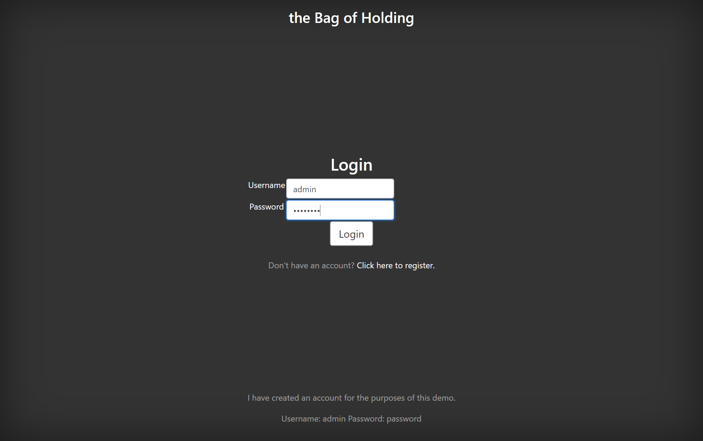

# QA Solo Project - the Bag of Holding

## Index

[Breakdown of the project is located here.](https://github.com/Kanimi/theBagofHolding)

## Selenium Tests

*Please click on the pictures to view full resolution.*

### Register Test

### Login Test

### Dashboard Tests
Added Dice (ID 12)

Updated Dice (ID 1)

Removed Diice (ID 1)
